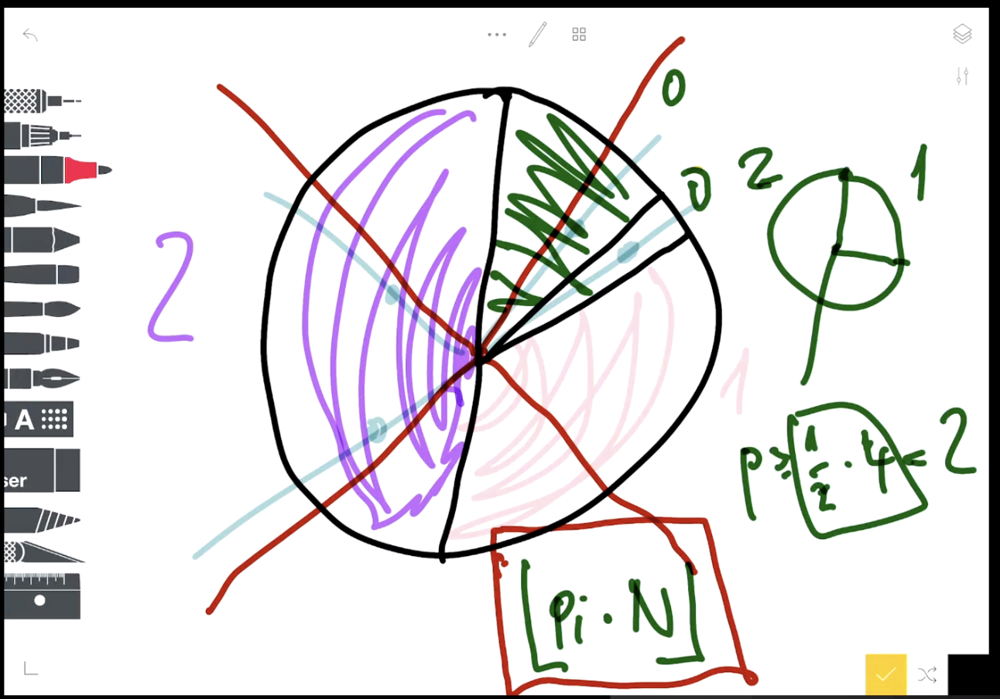
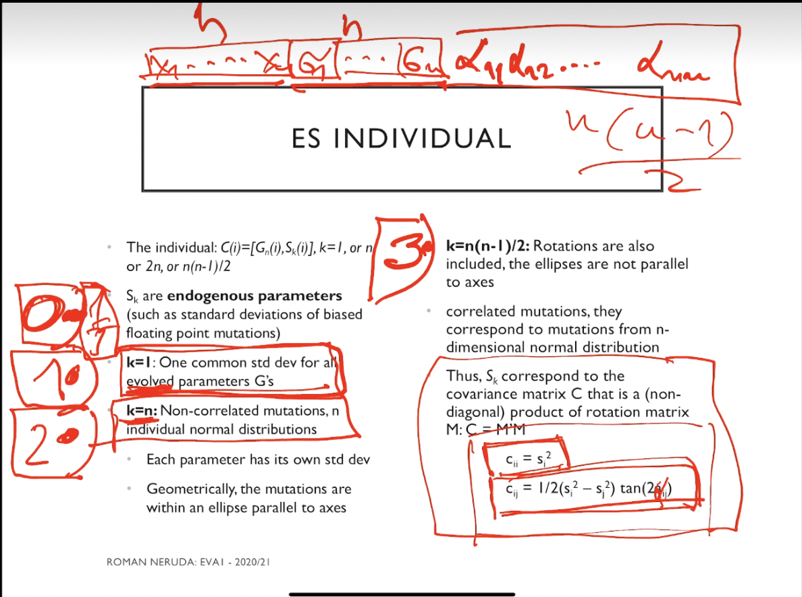
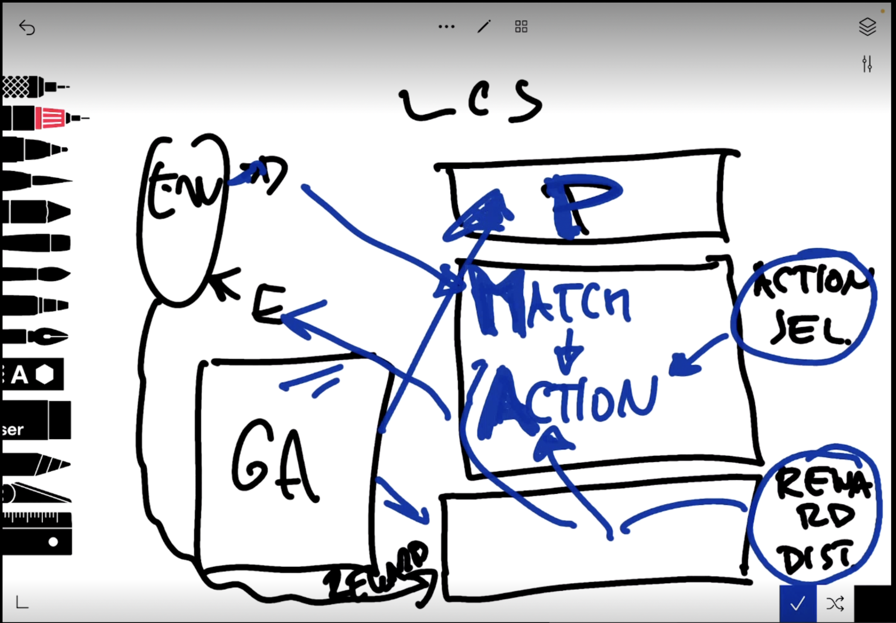
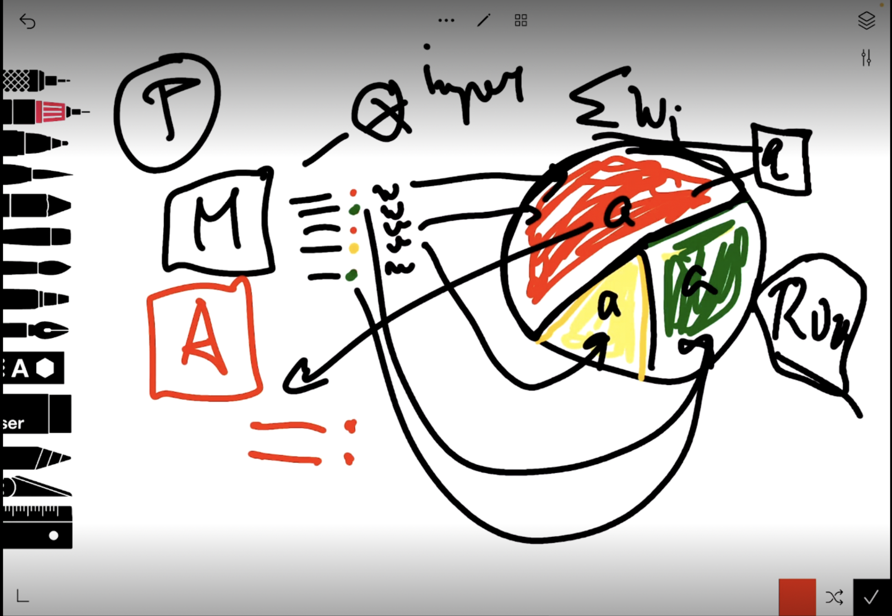
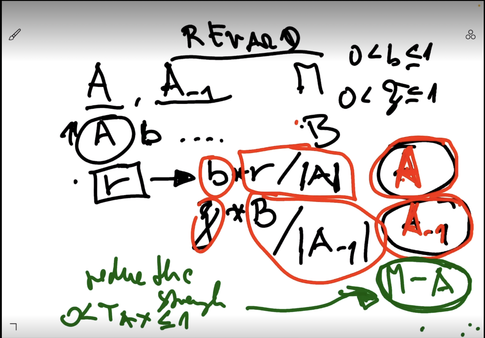
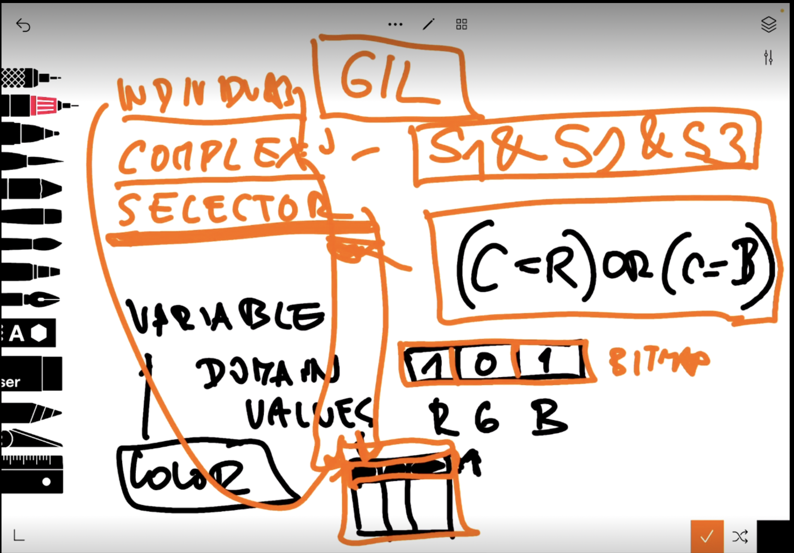

# Prednaska 2

fitness - vypocetne najtazsia. Selekcia, cross a mut su vacsinou konstante/linearne voci vstupu. fitness byva ovela tazsie zistit (napriklad v TSP spocitat dlzku cesty)

## schemy

pozicie kt nie su hviezdicky - fixed posisitons
order of a scheme = pocet fixed position
fitness of a scheme - selekcia (pocita sa ako priemer vsetkych prvkov z populacie ktori sedia na schema)

mutacie - ak trafi hviezdicku, schema prezije, ak trafi fixed to uz je ina schema
cross - ak pred (alebo za) cross pointom su len same hviezdicky - schema prezije
defining length = last fixed position - 1st fixed position
    **10*1*** 
        first = 3
        last = 6
        defining = 6 - 3 = 3

## exploration vs explotation
exploration - skumat rozne moznosti
explotation - zamerat sa na lokalne optimum

TST
* nevyhody:
  * populacie su konecne a male - teoreticky exponencialny narast je naruseny sampling errorom
  * competition of a schemata is much more complex and not independent
  * ignoruje konstruktivny efekt operatorov

# Prednaska 3

## Encoding
* Binary (Holland)
  * nice theoretical result
  * sometimes unnatural for given problem
* Alphabets with more symbols
* Integers
* Permutations (TSP)
* Neural networks
* Graphs

## Selection
* Rullete wheel (normalized fitness)
* SUS - Stochastic universal sampling
  * tossing ball once - others will be calculated with fixed offset from the first position

* Tournament
  * k-tournament = nahodne zvolim k jedincov ktorych porovnam -> vyhercu vratim ako vysledok selekcie
  * doesnt suffer of premature convergence like in rullete/SUS

## Integer encoding

### Mutation
* unbiased - random value from domain
* biased - random shift (normal distribution) from original value
### Cross
* uniform - pri kazdom prvku jedinca sa nahodne rozhodneme ktori zvolime
* one/multi point cross
* arithmetic - (priemer/some other convex combination) jednotlivych prvkov rodicov

# Prednaska 4 (Evolutionary strategies)

M - number of individuals in population
L - number of new individuals
R - number of parents

Special selection notation:
* (M + L) - M individuals from M+L
* (M,L) - M individuals from L

20% rule - najlepsi pomer medzi exploitation a exploration je ked mutacia vytvori 1 jedinca ktory je lepsi a 4 ktori su horsi

## Selection
* Parental - random, does not depend on fitness
* Enviromental
  * dependent on fitness
  * Deterministic
    * select M best from the pool
    * (M,L) strategy = L > M, avoids local optima better, better fo real-value domains
    * (M+L) strategy, faster convergence, recommended for discrete-value domains

## Individuals
* x = (x1, ... , xn) + (parametre)
* parametre = sigmy na mutaciu. 
  * Pre vsetky x 1 sigma = 20% rule
  * Kazdy prvok si zo sebou nesie vlastne sigmy
    * 1 = kruh, n = elipsa, n(n-1)/2 = zrotovana elipsa

## Cross
"gang bang" viacerych rodicov -> 1 potomok
* Local (R=2)
* Global (R=M)

* Uniform - random z rodicov na konkretnej pozicii
* Arithmetic - priemer z rodicov

# Prednaska 5 (Evolution of cooperation)

## Altruism vs Darwinism
Darwinism - inherently competetive - survival of the fittest

## Prisoners dilemma
Nash vs Pareto 

Nash equilibrium
Pareto - snazime sa kooperovat. Pareto optimal = neexistuje lepsia strategia ktora by neposkodila mojho partnera.

TfT strategy - Tit for Tat - zo zaciatku sa snazit kooperovat, ale potrestat zradu

# Prednaska 6 (Evolutionary ML)

(un)Supervised/reinforcement learning

Rule = if < input > then < output >

2 schools of EVA ML:
* Michigan
  * Individual = 1 rule
  * Population = system
* Pittsburg
  * Individual = set of rules (complete system)
  * Population = set of complete systems

Accuracy = (TP + TN) / sum
Sensitivity = how sensitive are we to TP = TP/(TP + FN)
Specificity = TN that are correctly identified = TN/(TN + FP)

## Michigan
* Learning classifier systems (LCS)
  * 
  * 
  * messages sa uz nepouzivaju - su zastarale. Rules obsahovali namiesto podmienky a action pridanu hodnotu ktora mohla modifikovat interne spravanie (pri skoku zaby zniz energiu, ...)
  * individual = rule
  * binary encoding of input with stars, star = dont care
  * each rule has "strength" (may be fitness)
  * Bucket brigade algorithm - ked aplikujeme nejake pravidlo, znizime mu strenght. Ale ak bolo sucastou chainu ktory nas doviedol k uspesnemu vysledku, rozdistribuujeme odmenu, takze v konecnom dosledku budeme mat vyssi strength. Neni velmi pouzivany pretoze je tazke odhadnut zaciatocne vahy
* Zero classifier system (ZCS)
  * zjednoduseny
  * NO internal messages, NO BB algorithm, introduced cover operator
  * Action selection:
    * P = population - set of rules
    * Detector presents input x
    * M - match set (rule with condition satisfied compared to x)
    * Action a is selected from M
      * rullet wheel skladajuci sa z actions na zaklade rule strength
  * pamata si iba 2 tahy - odmenu dostane len aktualne a predchadzajuce pravidlo
  * 
  * zo vsetkych matching rules podla ich vah vytvorime roullete wheel a vyberieme aku akciu vykoname
  * Podla vybranej akcie vytvorime action set - pravidla ktore aplikuju danu akciu
  * 
  * po ceste trochu znizujeme strength - akumulujeme do B, ak natrafime na reward - reward rozdelime medzi A, to co sme naakumulovali v B rozdelime do B, a vsetky pravidla ktore boli v matching sete ale nie v action sete potrestame tym ze im znizime strength
  * cover operator - ak nemame pravidlo ktore by pokrylo podmienku, vytvorime ho (pomocou hviezdiciek pridanych nahodne a nahodnou akciou) a pridame do potomkov

# Prednaska 7 

Classification - special case of supervised learning

Michigan - lepsi pre RL (reinforcement learning)

Extended classifier system (XCS)
* hlavny rozdiel oproti ZCS je oddelenie strength od fitness (ako fitness teraz pouzivame accuracy) a pustanie GA len na Action set
* doterajsi reward system (ZCS) musi byt vylepseny aby zahrnal aj pravidla na zaciatku retazca, pravidla s malym strength ktore su uzitocne mohli tiez vymriet (nedostavali dostatocne ocenenie),... 
* Pravdilo je tuple (c, a, p, e, f):
  * c - condition
  * a - action
  * p - payoff prediction
  * e - prediction error
  * f - fitness used in GA (zalozena na accuracy)
* Postup:
  * Na zaklade inputu sa vytvori match set M
    * M je potom podrozdeleny na action sety Ai (na zaklade akcii)
    * Drzime si aj predchadzajuci action set
  * Pre kazdu akciu v Ai vypocitame payoff - priemer payoffs action setu (berieme do uvahy aj ich fitness)
  * Zvolime vyhernu akciu a - bud ako max payoff alebo roulette wheel
  * Rozdistribuujeme payoff z environmentu medzi akcie z predchadzajuceho action setu
    * update errorov, fitness, payoff
  * Pustime GA iba na predchadzajuci action set

## Pittsburg
* Individual has many rules
* mostly for classification
* GIL
  * 
  * pittsburg rule system
  * specifies for binary casification tasks
  * individual (set of complexes)
  * complex (rule - consists of selectors)
  * selector (represented as a bitmap)
  * mutation
    * can be simple bit-flip, reduction (1 -> 0), generalization (put 1 everywhere - ekvivalent to star everywhere)
  * Operators on the individual level:
    * swap/copy/generalization/deletion of rule(s)
  * Operators on the complex level:
    * Split of complex on 1 selector, generalization of selector (vsade 11...1), specialization of generalized selector
  * Operators on selectors:
    * Mutation 0 <-> 1, extension 0 -> 1, reduction 1 -> 0

# Prednaska 8 (Multi-objective)

Vysledok fitness funkcie nie je jedno cislo, ale mnozina f1,...,fn

# Prednaska 9 (TSP, Knapsack)

TSP
* Permutation
  * Crossovers:
    * PMX (Partially mapped Xover)
      * Preserve cities at their position
      * 1 - 2 point version (usually)
      * Swap centers (creates a mapping), put remaining cities in their position (if possible), fill in remaining cities according to center mapping

    * OX (Order Xover)
      * V podstate to co som implementoval, swapne sa stred a poporade sa doplni zvysok
* Adjacency representation (obsolete)
  * Good for schemata
  * 1-point corssover doesnt work
  * introduces more problems than advantages
* Ordinal
  * index in a buffer, but after indexing city, its removed from buffer (which is then reshaped)

# Prednaska 10

Pokracovanie cross operacii nad permutaciami:

* CX (Cyclic Xover)
  * Vyberieme nahodne poziciu z prveho rodica a polozime na rovnake miesto. Potom pozrieme s cim koliduje a to doplnime znova na rovnake miesto ake ma dane cislo v prvom rodicovi. Ak sa tento cyklus uzavrie, zvysok doplnime z druheho rodica poporadi

* Edge recombination (ER):
  * zameriava sa na hrany, nie na vrcholy
  * zachovavame hrany, nie vrcholy
  * pre kazde mesto mame list miest s ktorymi sa spaja
  * Zacneme z vrcholom a dalsi berieme podla toho, ktory zo susedov ma najmenej vrcholov v liste (pokial rovnaky pocet tak volime random)

* ER2:
  * ER ale prioritizujeme vrcholy ktore maju 1 spolocnu hranu

Inicializacia:
* nearest neighbor : hladame najblizsi vrchol k poslednemu pridanemu
* edge insertion : hladame najblizsi vrchol k hocijakemu z uz pridanych. Po jeho pridani moze nastat ze budeme musiet vymazat niektoru uz existujucu hranu aby sme zachovali to ze kazdy vrchol navstivime prave raz

Mutacia:
* Inversion
* Swap 2 cities
* Swap 2 subpaths

2-OPT:
* Hladame 4 mesta ktore su spojene dokopy a hladame ine spojenie medzi nimi ktorym to zamenime a zlepsime cestu

Other problems:
* Scheduling (NP) - rozvrh
* Job shop scheduling (NP) - planning AI. Products, parts, machines. Fitness = minimize production time

# Prednaska 11 (Genetic programming)
* Machine code - linear GP
* Tree-bases (most successful)
  * Compilers (source code is transfered into tree represantation)
* Source code - not suitable for GP

* Programs = trees
  * Terminals - constants, vars
  * Non-terminals - operations

Mutation:
* replace a subtree with newly generated one
* replace a node (arity)
* Mutation of constants

Cross:
* choose a node in parents graphs (it then represents a whole subtree) ad swap them.
* Uniform cross (GPUX) - zaciatok swap velke stromy, na konci skor lokalne zmeny - identifikuju sa spolocne subtrees - ked sme na hranici, swapujeme subtrees

Initialization:
* generate tree at random:
  * Grow - limit on no. nodes
  * Full - limit on depth(start using Non-terminals only and finish with terminals)
  * Combination of above (do it 50-50) - "ramped half-and-half"
* May be used in mutation

Symbolic regression

Problem of bloat (prilis velke stromy):
* limits size
* mut and cross provide smaller individuals
* penalize size in fitness
* shrinking mut

# Prednaska 12 (DE, PSO)

DE - differential evolution
* fn : Rn -> R
* treat f as blackbox
* Muation:
  * For mutation Xi choose 3 different individuals Xa, Xb, Xc. V = Xa + F * (Xb - Xc). F = <0,2>
* Cross:
  * U = Xi x V (uniform)
* Compare F(Xi) and f(U) -> better goes to the next population
* Selection is not really happening - we are iterating through all individuals and perform mut and cross on them
* Other mutations:
  * Basic mutation = rand/1 (Xa is chosen randomly, 1 difference using 2 vectors)
  * rand/2 - Xa random, choosing 4 individuals, V = Xa + F * (Xb - Xc + Xd - Xe)
  * best/1 - Xa best, 1 difference
* Other Cross:
  * 2-point

PSO (Particle Swarm Optimization)
* Population = particles = vector Rn
* No cross or mut
* Particles has:
  * position
  * velocity
* Pbest - for each particle, best position
* Gbest - for population - best position of a particle
* Initialization - by random positions and velocities
* Compute fitness of each particle, update Pbest and Gbest
* For all particles:
  * Update velocities and positions
    * V = V + Cp * (Pbest - X) +  Cg * (Gbest - X)
      * Cp = constant for Pbest, Cg - constant for Gbest
    * Update position according to velocity
  * Update Pbest and Gbest